<p align="center">
  
</p>

<h1 align="center">MeterOak</h1>

<p align="center"><strong>Bringing your usage in focus.</strong></p>
<p align="center">A local dashboard for AI coding usage, tokens, cache efficiency, and API cost estimates.</p>

<p align="center">
  <a href="#quickstart">Quickstart</a> ·
  <a href="#how-it-works">How it works</a> ·
  <a href="#privacy-and-storage">Privacy</a> ·
  <a href="#screenshots">Screenshots</a>
</p>

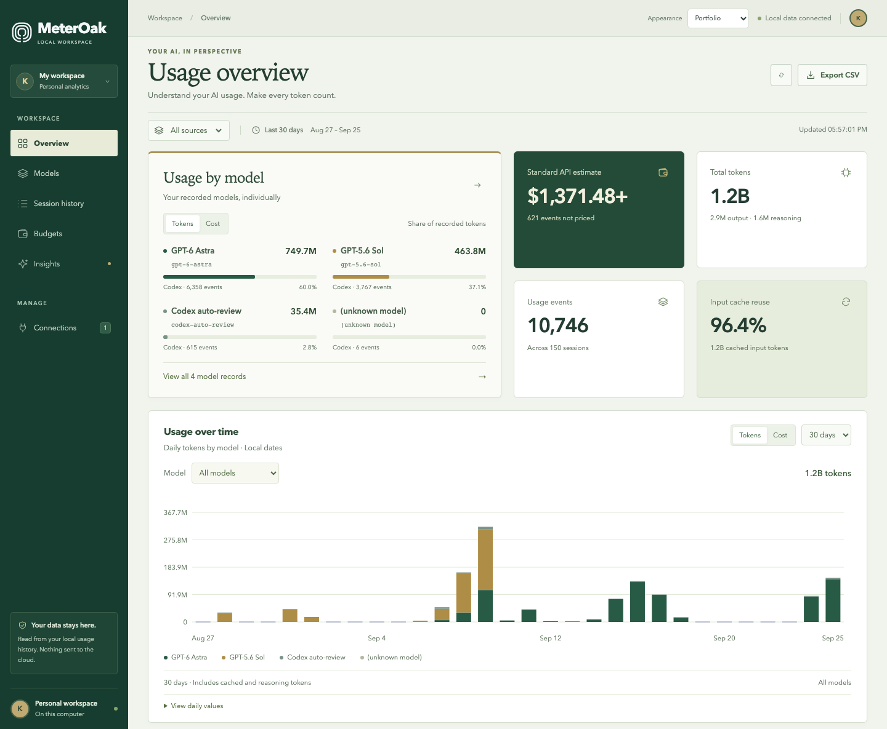

<p align="center"><sub>Portfolio mode · Sanitized example records · Dollar values are estimates, not a bill.</sub></p>

**Currently supports Codex and OpenCode only.** No MeterOak account, API key, or billing connection is required.

## Inside the dashboard

| Page | What it shows |
| --- | --- |
| **Overview** | Token totals, cache reuse, daily trends, model allocation, and known API-equivalent cost. |
| **Models** | Usage and cost by model, with search, sorting, and missing-price visibility. |
| **Session history** | Searchable sessions, token breakdowns, details, and CSV export. |
| **Budgets** | Browser-saved targets and threshold warnings. These do not limit or stop usage. |
| **Insights** | Usage patterns, cache efficiency, cost coverage, and a 30-day API-equivalent cost run rate. |
| **Connections** | Local source availability, scan diagnostics, and recorded usage-limit snapshots. |

Portfolio is the default; Original is available in the appearance selector. Both support desktop and mobile, combined/per-source views, and 10-second data refreshes.

## Quickstart

Requires **Node.js 24.2+**, npm, and local usage records from Codex or OpenCode.
From the MeterOak project directory:

```sh
npm ci
npm start
```

Open **[localhost:4520](http://localhost:4520/)**. The launcher starts Vite on port `4520` and the reader on `4491`, both bound to `127.0.0.1`. Stop with **Ctrl+C**. Opening `index.html` directly will not work.

Check **Connections** for missing sources or scan issues. No sample data replaces missing local records.

## How it works

```text
Codex JSONL logs ─────┐
                     ├─→ Local Node.js reader → localhost API → React dashboard
OpenCode SQLite DB ──┘
```

- **Codex:** reads `$CODEX_HOME/sessions`, or `~/.codex/sessions` by default. JSONL files are read in 64 KB chunks; malformed or oversized records are reported.
- **OpenCode:** opens SQLite **read-only**, using `OPENCODE_DB` or detected data directories, typically `~/.local/share/opencode/opencode.db`. See [source discovery](server/adapters.mjs) for platform fallbacks.
- **Accounting:** normalizes timestamps, models, and token counters; handles cumulative counters and overlapping session files; aggregates **30 local calendar days**. Charts offer 7-, 14-, and 30-day views.

Model names come from recorded metadata; missing models stay unknown. Unreadable files, incomplete scans, and missing prices are disclosed. Totals depend on the records available locally.

## Privacy and storage

**Your usage stays on your machine. MeterOak does not upload it to a hosted MeterOak service.**

| Data | Where it lives |
| --- | --- |
| Original usage history | Codex files and OpenCode's database on your device; MeterOak does not modify them. |
| Parsed usage and aggregates | The local Node.js process's in-memory cache. |
| Appearance and budget preferences | This browser's `localStorage`. |
| Model prices | The project's local [pricing table](server/pricing.json). |

There is **no MeterOak persistent database or cloud account store**. The local session-detail API can include tool arguments/results; keep the reader accessible only on your own machine.

## Tokens and cost estimates

Token categories do not overlap: cached input is separated from fresh input, and reasoning from output, before totals are added.

Source-reported costs are retained. Otherwise, each usage event uses saved model rates in USD per million tokens:

```text
estimate = (fresh input × input rate
          + cache reads × cache-read rate
          + cache writes × cache-write rate
          + (output + reasoning) × output rate) ÷ 1,000,000
```

Configured long-context rates apply when request size is known. **Unpriced** events still count toward tokens. Saved prices do not update automatically.

**Estimates are not bills.** They exclude subscriptions, Fast-mode premiums, Batch/Flex discounts, tool fees, regional surcharges, and taxes. Actual paid charges require billing records.

## Technology

| Layer | Technology |
| --- | --- |
| Frontend | React 19, strict TypeScript, Vite 8, plain CSS, custom SVG charts and icons. |
| Backend | Node.js 24.2+, JavaScript ES modules, native HTTP and filesystem APIs. |
| Data access | Chunked JSONL parsing; Node's built-in `node:sqlite` for read-only OpenCode access. |
| Storage | Source files/databases, an in-memory reader cache, and browser `localStorage` for preferences. |
| Quality checks | Node's test runner, TypeScript checks, Playwright Chromium, and Prettier. |

## Screenshots

Every dashboard capture below uses **Portfolio mode** and a sanitized snapshot. Open a section to see the full page.

<details>
<summary><strong>Overview — complete page</strong></summary>

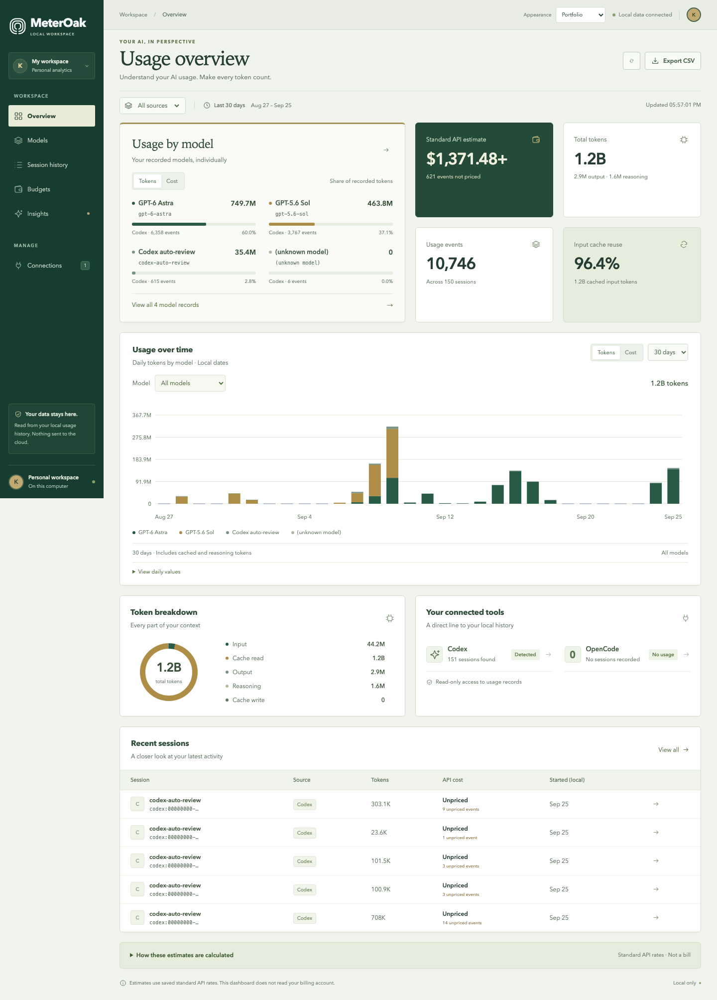

</details>

<details>
<summary><strong>Models</strong></summary>

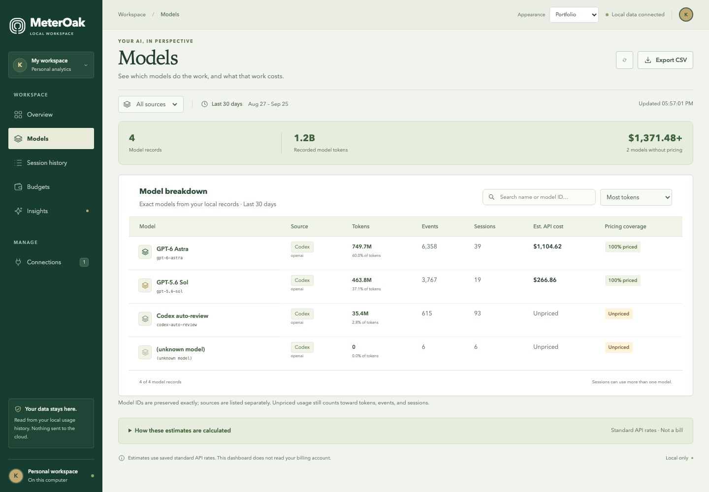

</details>

<details>
<summary><strong>Session history and details</strong></summary>

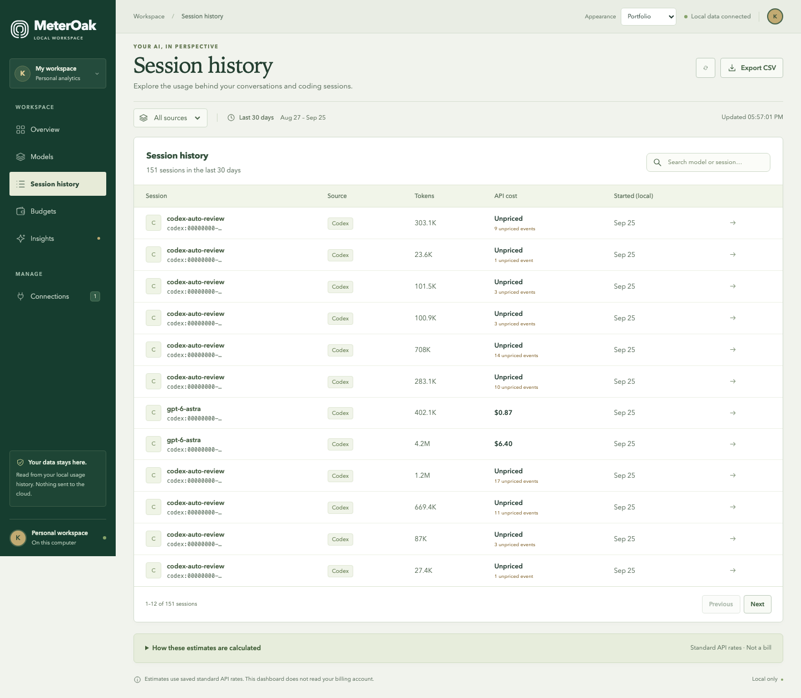

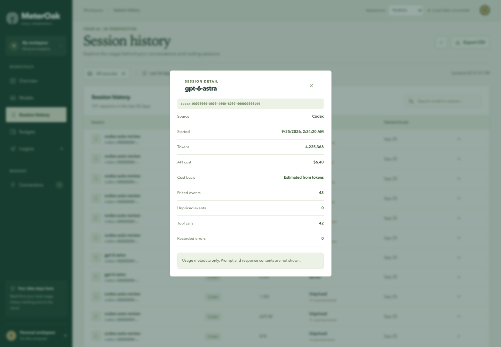

</details>

<details>
<summary><strong>Budgets</strong></summary>

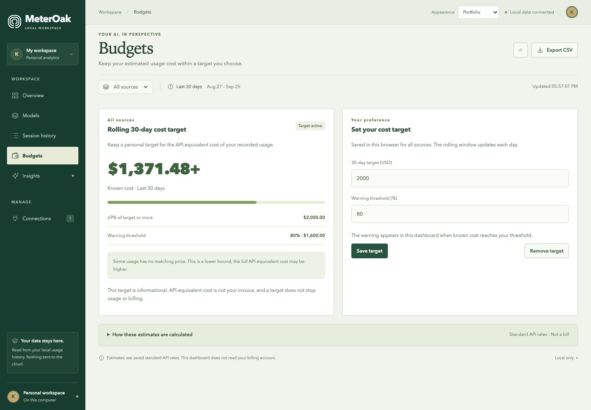

</details>

<details>
<summary><strong>Insights</strong></summary>

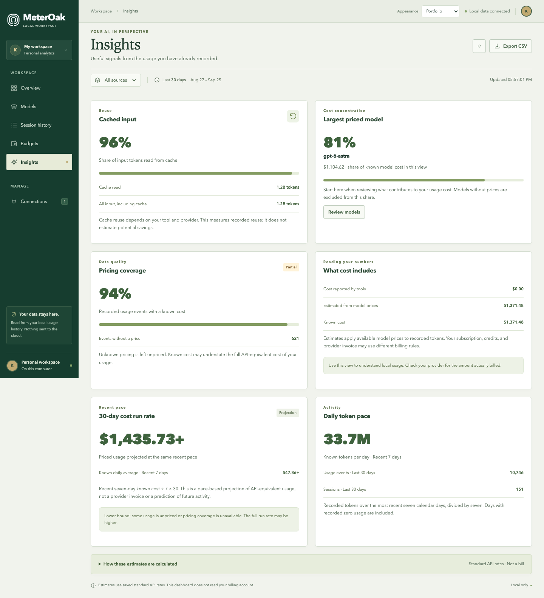

</details>

<details>
<summary><strong>Connections</strong></summary>

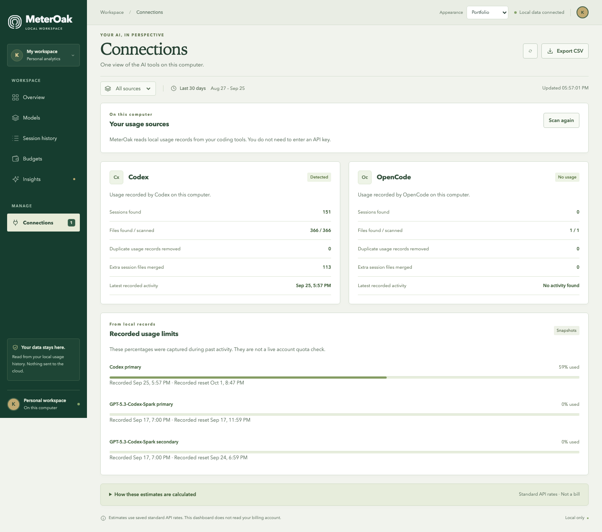

</details>

<details>
<summary><strong>Pricing methodology</strong></summary>

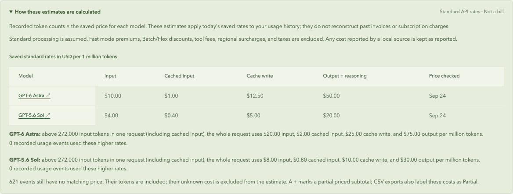

</details>

<details>
<summary><strong>Mobile overview and opening screen</strong></summary>

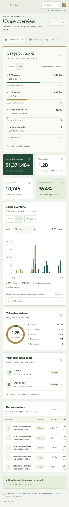

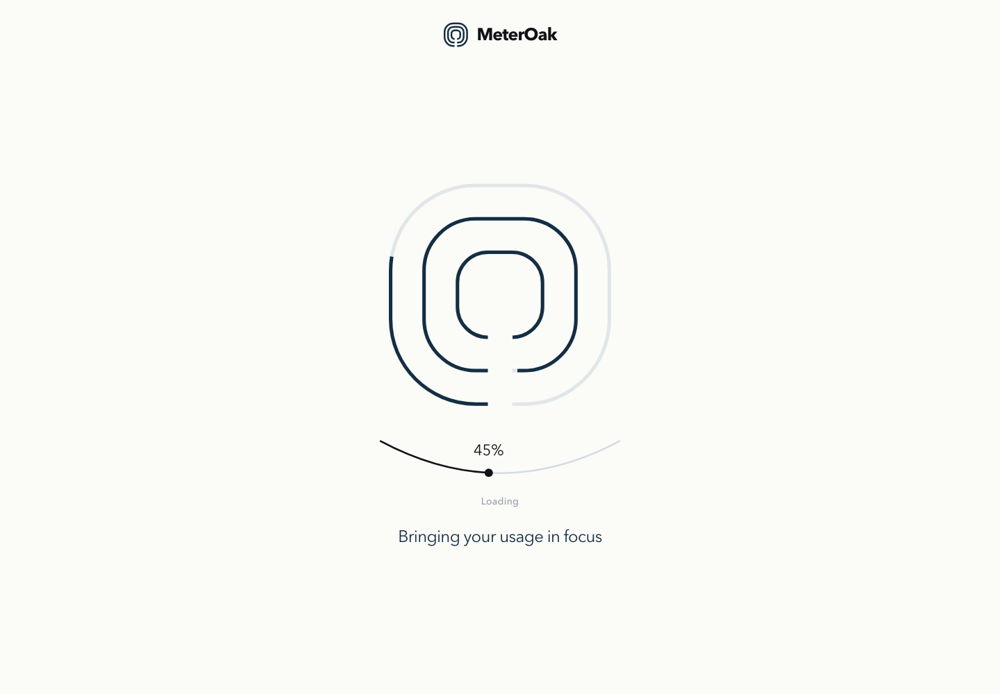

</details>

## Roadmap

Planned integrations: **Claude Code, Cursor, Antigravity, Devin, and more AI IDEs and coding agents**. These are future goals; current support remains **Codex and OpenCode only**.

## Development

```sh
npm run build          # Type-check and create dist/
npm test               # Reader, accounting, and frontend data tests
npm run format:check   # Check source formatting
```

See [browser checks](test/README.md) for isolated Playwright coverage of navigation, calculations, exports, responsive layouts, and the opening animation.

## License

[MIT](LICENSE). Retain the included copyright and license notices when redistributing.
